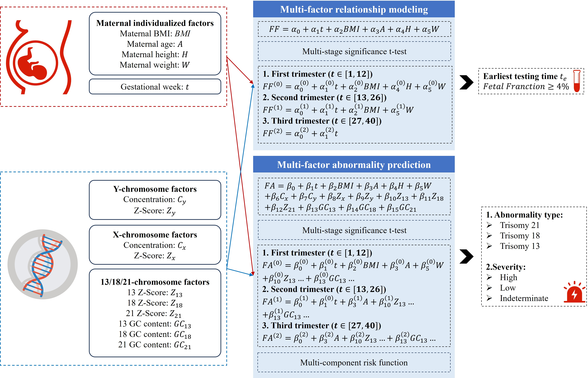

<h1 align="center">
MF-NIPT: Multi-Factor Statistical Modeling for Non-Invasive Prenatal Testing Time Selection and Fetal Abnormality Prediction
</h1>
<p align="center">


</p>

Non-Invasive Prenatal Testing (NIPT), which analyzes cell-free fetal DNA (cffDNA) in maternal plasma, has emerged as a reliable method for detecting fetal chromosomal abnormalities. However, conventional NIPT protocols often neglect inter-individual maternal variations—such as body mass index (BMI), gestational age, and other physiological parameters—that significantly influence fetal fraction (FF) concentration and assay accuracy. To address this limitation, we propose a multi-factor statistical modeling framework, MF-NIPT. The framework synergistically integrates statistical inference and machine learning to enable personalized selection of the optimal NIPT timing and accurate prediction of fetal anomalies. The MF-NIPT framework comprises two core modules: Multi-Factor Relationship Modeling (MFRM) and Multi-Factor Abnormality Prediction (MFAP). Experimental results demonstrate that MF-NIPT accurately predicts FF, identifies the earliest viable gestational week for NIPT, and achieves an F1-score of 0.918 in abnormality detection for female fetuses. This work establishes a mathematically interpretable and clinically actionable foundation for individualized, risk-aware NIPT decision-making.


<p align="center">
 <br>
<b>Figure 1.</b> Structure of MF-NIPT.  
</p>


## Conda Environment Setup

``` shell
conda create -n mfnipt python=3.13 -y
conda activate mfnipt
```

## Dataset

### **CUMCM-2025C**

The data in this study originate from cffDNA sequencing results of pregnant women, categorized by fetal sex. The dataset used is CUMCM-2025C, provided by the China Undergraduate Mathematical Contest in Modeling (CUMCM). It contains 1,687 maternal samples, including 1,082 male-fetus samples and 605 female-fetus samples. Maternal feature variables include gestational week (t), body mass index (BMI), height (H), weight (W), age (A), and GC content (GC). Fig. 2 shows the distribution of key factors in the CUMCM-2025C dataset: Z-scores of chromosome X, concentration of chromosome Y, and maternal BMI.

<p align="center">
 <br>
<b>Figure 2.</b> Distribution of CUMCM-2025C data, including Z-score of chromosome X, concentration of chromosome Y, and maternal BMI—three key factors.  
</p>


### Load Dataset

```python
import pandas as pd
from datasets import load_dataset

# load data from huggingface hub
repo_id = "cumcm-dataset/CUMCM-2025c-dataset"
dataset = load_dataset(repo_id)
data = dataset['train'].to_pandas()  # to pandas DataFrame

# data filter
female_fetus_data = data[data[' Fetal Type (e.g., Male Fetus)'] == 'Female Fetus']
male_fetus_data = data[data[' Fetal Type (e.g., Male Fetus)'] == 'Male Fetus']

x_chromosome_z_score_female = female_fetus_data[' Z-Score of Chromosome X']
y_chromosome_concentration_male = male_fetus_data['Concentration of Chromosome Y']
bmi_data = data[" Pregnant Woman's BMI (BMI: Body Mass Index)"]
```

## Train

1. The training process includes three key steps: data preprocessing, model training, and result saving.

   ### Data Preprocessing

   Data preprocessing is implemented in `preprocessing.py`, with the following main steps:

   1. **Data Loading**: Load raw data from Hugging Face Dataset or local `raw.csv` file
   2. **Data Cleaning**: Standardize column names, convert gestational age (calculate days), compute BMI, etc.
   3. **Feature Engineering**: Calculate features like the earliest viable gestational week (g*) for each pregnant woman
   4. **Data Splitting**: Split data into 80% training set and 20% test set. Ensure no data from the same pregnant woman exists in both sets.

```python
# Example of data preprocessing and splitting
from preprocessing import ensure_data_split

# Perform data splitting to generate train.csv and test.csv
train_df, test_df = ensure_data_split(train_frac=0.8, random_state=42)
```

Split data is saved in the `data/` directory:

- `data/train.csv`: Training set
- `data/test.csv`: Test set

### Model Training

The project includes 4 core models, all trained on the training set:

1. **Statistical Relationship Modeling (MFRM-1)**: Analyze statistical relationships between factors
2. **BMI Single-Factor Timing Model (MFRM-2)**: Predict optimal NIPT timing based on maternal BMI
3. **Multi-Factor Timing Model (MFRM-3)**: Predict optimal NIPT timing using multiple factors
4. **Abnormality Risk Prediction Model (MFAP)**: Predict fetal abnormality risk

Training is executed automatically by running the main script:

```bash
python main.py
```

### Training Outputs

Training results are saved in the `results/` directory, with subdirectories for each model:

- `results/mfrm_stat/`: Statistical analysis results
  - `clustermap.png`: Cluster heatmap
  - `ols_summary.txt`: OLS regression summary
  - `significant_coef.png`: Significant coefficients plot
  - `spearman_heatmap.png`: Spearman correlation heatmap
  - `vif.csv`: Variance Inflation Factor table
- `results/mfrm_timing_single/`: Single-factor timing model results
  - `bmi_groups_detail.csv`: BMI group details
  - `df_gstar_train.csv`: Training set g* data
  - `greedy_convergence.png`: Greedy grouping convergence plot
  - `roc_curve_test.png`: ROC curve
- `results/mfrm_timing_multi/`: Multi-factor timing model results
  - `bmi_groups_detail_multivar.csv`: Multivariate BMI group details
  - `df_gstar_train_multivar.csv`: Multivariate training set g* data
  - `greedy_convergence_multivar.png`: Multivariate greedy grouping convergence plot
  - `roc_curve_multivar_test.png`: Multivariate ROC curve
- `results/mfap_risk/`: Risk prediction model results
  - `risk_assessment_results_test.csv`: Test set risk assessment results
  - `roc_test.png`: Risk prediction ROC curve

## Test

The test process uses trained models and the test set to evaluate performance, including model assessment and result visualization.

### Test Data

Test data is `data/test.csv` (generated during preprocessing), containing 20% of raw data. It is completely independent of the training set to ensure objective evaluation.

### Model Testing

All models are evaluated on the test set:

1. **MFRM-1**: Verify stability of statistical relationships on test data
2. **MFRM-2**: Evaluate AUC and Brier score with trained GBDT model; generate ROC curve
3. **MFRM-3**: Assess performance of multivariate GBDT model; verify coverage via BMI grouping
4. **MFAP**: Evaluate AUC and F1-score with PSO-optimized decision tree model; generate confusion matrix

Testing is executed automatically by running the main script:

```bash
python main.py
```

### Test Outputs

Test results are saved together with training outputs in the `results/` directory:

- `results/mfrm_timing_single/`:
  - `roc_curve_test.png`: ROC curve for BMI-only model
  - `bmi_groups_detail.csv`: BMI group details (including train/test coverage)
- `results/mfrm_timing_multi/`:
  - `roc_curve_multivar_test.png`: ROC curve for multivariate model
  - `bmi_groups_detail_multivar.csv`: Multivariate BMI group details (including train/test coverage)
- `results/mfap_risk/`:
  - `roc_test.png`: ROC curve for abnormality risk prediction
  - `risk_assessment_results_test.csv`: Detailed test set risk results (true label, predicted label, risk score, risk grade)
